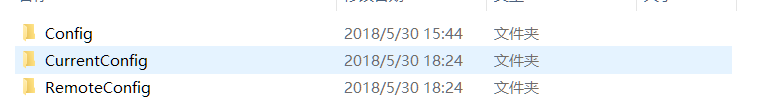
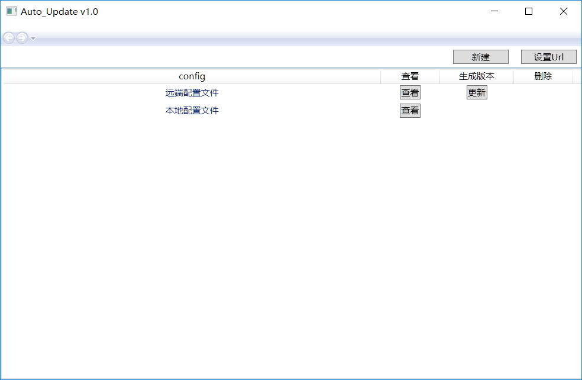
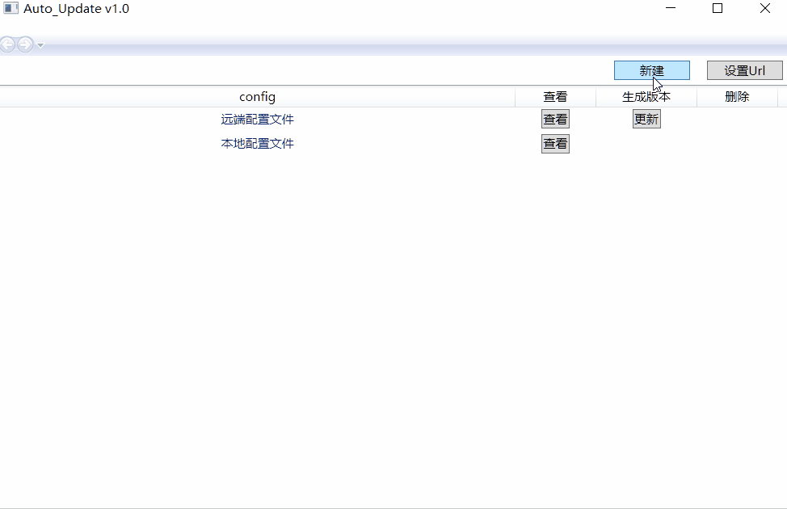
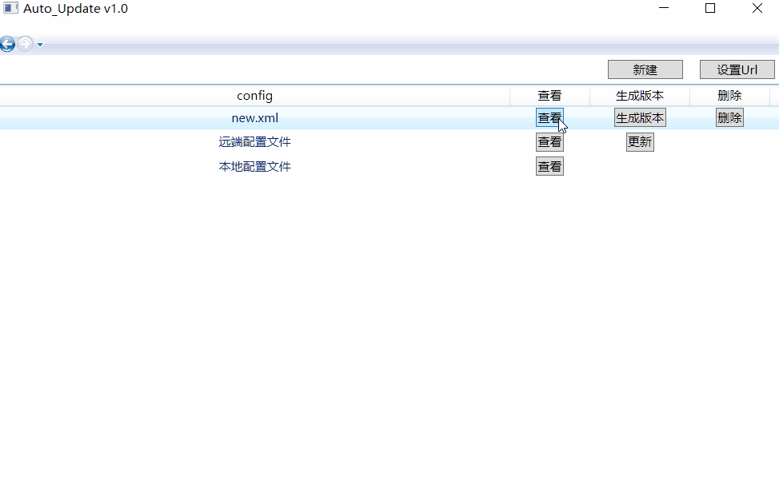
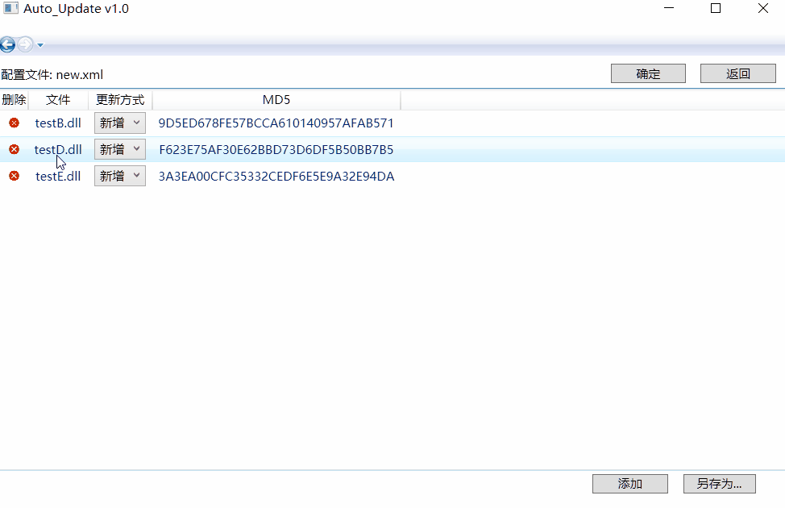
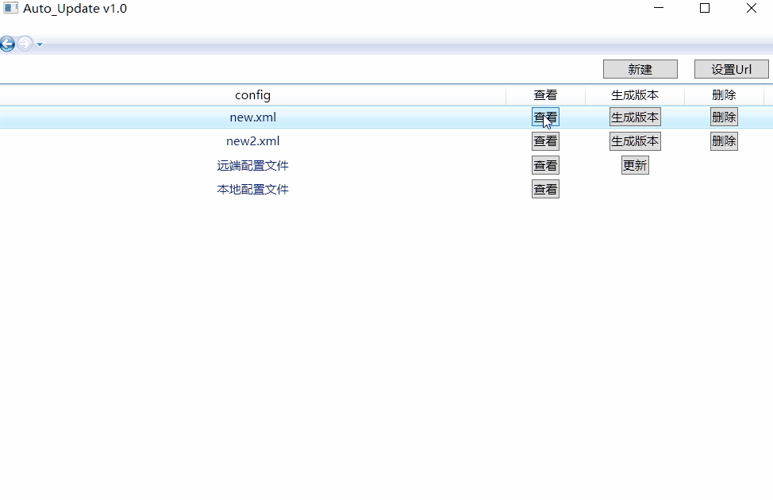
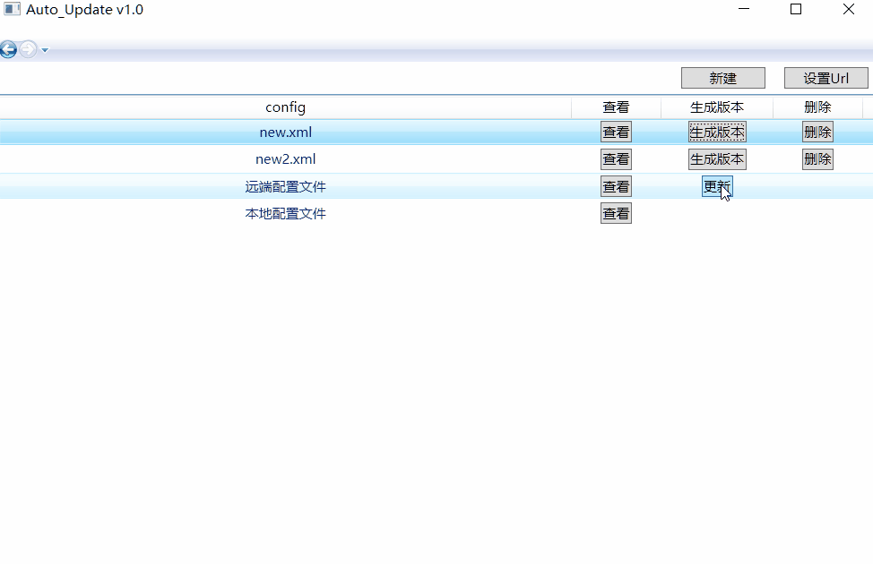

# Auto_Upgrade

自动更新版本软件 :poop:

## 软件介绍 :thumbsup:

### 三个主要目录
- Config： 该目录存放着本地所有配置文件
- CurrentConfig: 该目录存放着当前软件使用的配置文件和目标文件
- RemoteConfig: 该目录模拟远端网站, 存放着远端的配置文件和目标文件

- 软件**启动**时， 
- 软件先加载**CurrentConfig目录下的配置文件**，
- 然后加载**Config目录下的配置文件**，
- 最后从**远端RemoteConfig目录**获取远端的配置文件放到**CurrentConfig**中

### 程序初始界面

### 新建配置文件

- 可以通过**添加**按钮来添加目标文件，添加目标文件时，会自动计算目标文件的**md5值**
- 添加目标文件时，若目标文件**已存在**于列表中，再次添加会略过（**去重功能**）
- 新建配置文件时，当添加的是 **Auto Upgrade.exe**时，更新方式为**替换**， 并且不能修改
- 通过**新建**按钮来新建一个新的配置文件
- 新建时，当新建的配置文件名**已存在**于Config目录中，会提示是否要**覆盖**（**检测文件是否存在**）

### 修改配置文件

- 通过点击**查看**按钮， 可以查看配置文件的内容
- 在配置文件内容界面， 可进行 **增删改**操作
- **增**操作仍会**查重**, 即目标文件已在列表，则不重复添加
- **增**操作时，添加的目标文件是 **Auto Upgrade.exe**时，更新方式为**替换**， 并且不能修改
- 点击**确定**按钮即会保存新的配置文件内容

### 另存为

- 通过点击**查看**按钮， 可以查看配置文件的内容
- 在配置文件内容界面，可在当前配置文件的内容基础上**另存为**一个新的配置文件

### 生成版本

- 生成版本: 即将**配置文件和目标文件** 一起复制到选定的目录下

### 更新

- 若远端配置文件不涉及**Auto Upgrade.exe**的升级，则更新不需要重启软件
- 若涉及，则需要重启软件
- 图中升级前软件版本是 1.0版本， 升级后版本是2.0版本

