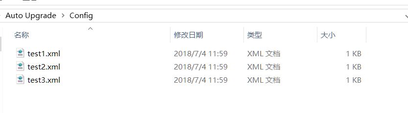
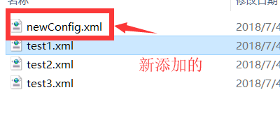

1. 程序介绍
===========

1.1 程序的根目录
----------------

### 1.1.1 Config目录

-   用于存放软件所在主机下的历史配置文件，包括其他软件的配置文件，如下：

### 1.1.2 RemoteConfig目录

-   远端网站的模拟目录

### 1.1.3 Resources目录

-   存放软件使用的图标的目录

### 1.1.4 currentConfig.xml、RemoteConfig.xml、UrlConfig.config

-   软件一运行，先**扫描一下程序的根目录**，生成软件的**currentConfig.xml**的配置文件

-   软件接着**根据UrlConfig.config**中保存的url，将指定的**远端配置文件下载**下来，并**命名为RemoteConfig.xml**；若UrlConfig.config中指定的远端配置文件是**不存在**的，则软件会提示指定的远端配置文件资源不存在，并会生成一个**空的RemoteConfig.xml**在本地。

### 1.1.5 UpdateClass.dll

-   软件更新模块的类库，将其封装成类库，可以提供给其他程序使用

### 1.1.6 update.exe

-   软件更新重启辅助小程序，用于更新重启本软件

### 1.1.7 Auto Upgrade.exe

-   软件的主程序

2. 使用
=======

2.1 程序启动时
--------------

-   软件一运行，先**扫描一下程序的根目录**，生成软件的**currentConfig.xml**的配置文件

-   软件接着**根据UrlConfig.config**中保存的url，将指定的**远端配置文件下载**下来，并**命名为RemoteConfig.xml**；若UrlConfig.config中指定的远端配置文件是**不存在**的，则软件会提示指定的远端配置文件资源不存在，并会生成一个**空的RemoteConfig.xml**在本地。

-   接着软件还会对**Config**目录进行扫描，将本地存放的其他配置文件加载到软件列表中。

2.2 新建配置文件
----------------

-   点击菜单栏“文件”-“新建配置文件”，即可新建一个新的配置文件

-   新建后的配置文件将保存在Config目录下

2.3 查看配置文件
----------------

-   点击“查看”

-   即可查看到该配置文件中的内容

-   配置文件的实际内容如图

2.4 修改配置文件内容
--------------------

-   软件支持对本地的配置文件信息进行修改，包括删除配置文件中的目标文件、修改配置文件中的目标文件的更新方式、新增新的目标文件（添加进来的目标文件的md5值是软件自动计算的）；

-   软件不支持直接地对本地配置文件和远端配置文件进行修改；

2.5 另存为新的配置文件
----------------------

-   软件提供在别的配置文件的基础上，另存为一个新的配置文件

2.6 删除配置文件
----------------

-   软件允许删除Config中的配置文件，通过点击“删除”按钮完成操作

-   软件的本地配置文件以及远端配置文件是不允许被删除的

2.7 生成版本
------------

-   点击配置文集列表中某一配置文件的“生成版本”按钮

-   生成版本即将**配置文件**和**目标文**件复制到**指定的目录**下

2.8 设置URL
-----------

2.9 自动更新
------------

-   根据2.8设置好URL，即可点击“更新”按钮进行更新

-   更新过程会有如图的提示

-   更新成功后程序会自动重启

2.10 多文档编辑功能
-------------------

-   程序允许多文档进行编辑

2.11 更新功能类库
-----------------

-   该类库可以提供给别的软件调用，实现其他软件的更新功能

-   其他软件的配置文件可由本软件进行编辑

### 2.11.1 演示

-   先通过本程序新建一个测试程序的配置文件

-   生成版本到RemoteConfig目录下

-   生成进来的版本

-   现有测试程序如下

-   运行程序，通过设置远端配置文件，即可进行调用UpdateClass.dll中的类库进行更新

-   进行更新

-   更新过程会有如图的提示

